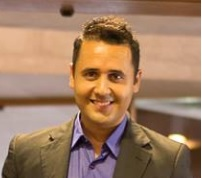
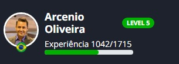

### Hi there 👋

# Minha Trajetória Profissional

## Arcenio Souza
### Técnico em Desenvolvimento de Sistemas

LinkedIn:
<a href="http://www.linkedin.com/in/arceniofso"> @ArcenioSouza</a>

Facebook:
<a href="https://www.facebook.com/arcenio.neto.3"> @ArcenioNeto</a>

---

## Sobre Mim
---
Sou nascido em São Paulo, filho de nordestinos e sou apaixonado por tecnologia. Sou fã do mundo geek e sou jogador de tênis de mesa, adoro um vídeo game e gasto horas jogando futebol, basta ter alguém que queira jogar comigo, sou dedicado a família e procuro estar presente em tudo que eles promovem.
Estou me dedicando muito para me tornar um Desenvolvedor FullStack e meu grande objetivo profissional para os próximos anos é ser bem sucedido nessa carreira assim como eu sou como educador.

---

## Formação
---
Iniciei minha trajetória como Educador Físico, trabalhando em clubes, academias e por fim em instituições sociais. Minha formação nessa área é:

 - `Licenciatura e Bacharelado em Educação Física` 
 Universidade Cruzeiro do Sul 
 Esse curso desenvolveu soft skills que considero importante, como organização e estratégias para conduzir equipes; Importância do treinamento de repetição para aquisição de habilidades cognitivas; Dinamismo, pró-atividade e cooperativismo.
   

Após 8 anos de experiência como Educador Físico, em 2017 decidi encarar um grande desafio profissional que foi assumir como professor uma turma de informática básica. Gostei da experiência e desde então tenho estudado bastante para atingir minha meta de ser um `Web Developer`. Minha trajetória de estudos:
            
- `Auxiliar técnico do programação - ETEC Itaquera` 
Esse curso me ajudou a conhecer um pouco de cada linguagem de programação e foi a base para compreender como funciona a lógica de programação que ainda hoje me ajuda a compreender o funcionamento de qualquer linguagem.
 

- `Técnico em Desenvolvimento de Sistemas - Etec Martin Luther King` 
Esse curso desenvolveu habilidades para criar sistemas em Java usando o Eclipse e o Android Studio, criar web sites usando as linguagens HTML, CSS, JavaScript e o framework da W3-Scholl, criar banco de dados usando o SQL Server e o MySQL, além de desenvolver soft skills importante para um programador como trabalho em equipe, persistência e dedicação aos estudos, dentre outras competências.
  

Depois de quase 12 anos como educador na mesma empresa e com uma bagagem de conhecimento teórico como desenvolvedor decidi que estava na hora de buscar a experiência profissional que tanto desejo e me aprofundar ainda mais nos estudos me dedicando integralmente, por isso saí da empresa e comecei a me dedicar a faculdade, a bootcamps e projetos de capacitação para empresas:
 

- `Engenharia da computação - Universidade Anhembi Morumbi` 
Meu objetivo com esse curso é explorar o universo que o mundo da tecnologia pode oferecer, minha expectativa é chegar ao final do curso conhecendo conceitos e funcionalidades com mais profundidade.
  

- `Projeto de formação da VTEX - Hiring Coders - em parceria com a GAMA ACADEMY` 
Estou vivenciando uma formação completa segundo a cultura da empresa VTEX, desde soft skills importantes para ser bem sucedido na profissão e contribuir em equipes de trabalho até conhecimento técnico completo que a profissão exige, com experiências reais, consultoria e mentoria com profissionais da VTEX e empresas parceiras.
   

- `BootCamps da Digital Innovation One` 
Está sendo incrível fazer parte da plataforma e aprender com tanto conteúdo gratuíto e de boa qualidade, além de estar proporcionando uma rede de networking com pessoas muito especiais e me dar uma devolutiva de como estou evoluindo.
 
